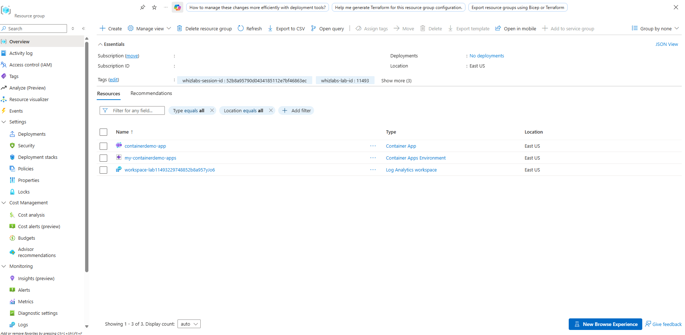
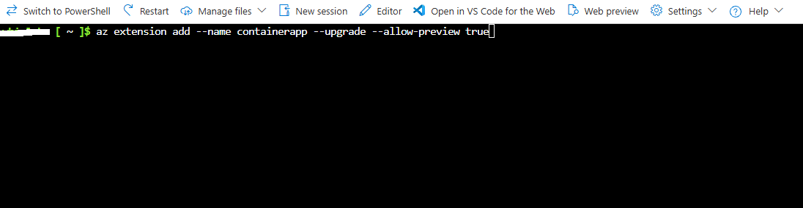
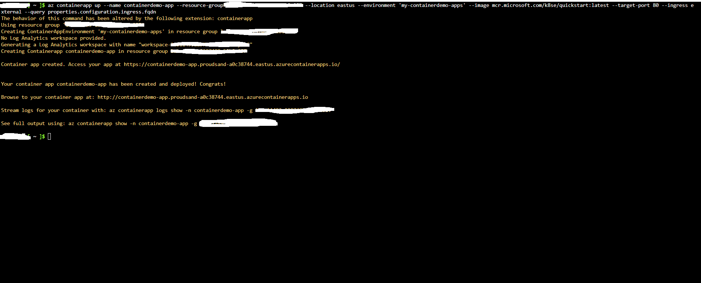
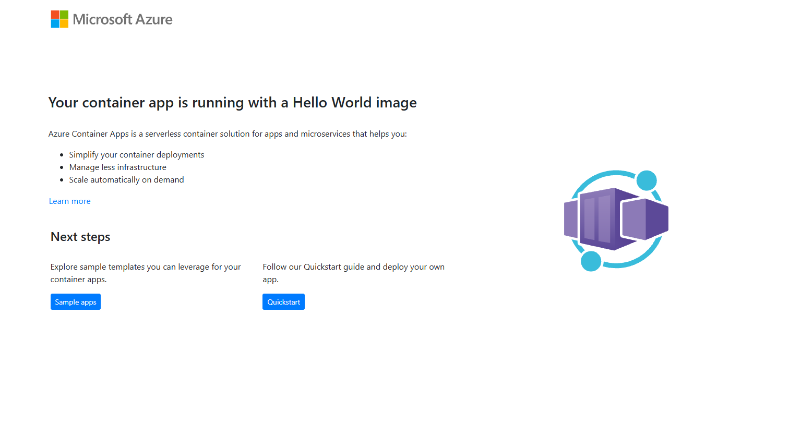

# Deploying Serverless Container App via Azure CLI Lab

Implementation proof documenting the end-to-end deployment of an Azure Container App, automated provision of the managed environment and Log Analytics workspace, external ingress configuration, and web application verification using Azure CLI in the East US region.

---

## 1. Architecture & Provisioned Resources

All lab infrastructure was provisioned in the East US region under resource group lab-11493-2297488-52b8a957:

* Container App: containerdemo-app - Serverless container app running the quickstart image, configured with 0.5 CPU cores, 1 GiB memory, single revision mode, auto-scaling up to 10 replicas, and external HTTPS ingress on target port 80
* Container Apps Environment: my-containerdemo-apps - Managed environment on Consumption workload profile providing network boundary and container orchestration
* Log Analytics workspace: workspace-lab11493229748852b8a957yJo6 - Automatically generated analytics workspace collecting operational logs and container metrics
* Ingress endpoint: https://containerdemo-app.proudsand-a0c38744.eastus.azurecontainerapps.io - Fully qualified domain name routed externally

*Resource group overview showing the deployed Container App, Container Apps Environment, and Log Analytics workspace.*

---

## 2. Implementation & Deployment 

### Step 1: Install and Upgrade Container App Extension

Added the Azure CLI containerapp extension with preview features enabled to allow management and deployment of Azure Container Apps and managed environments.

*Adding and upgrading the containerapp extension in Azure CLI.*

---

### Step 2: Deploy Container App and Environment

Executed the az containerapp up deployment command to provision the application named containerdemo-app within managed environment my-containerdemo-apps, automatically generating the backend Log Analytics workspace, pulling the quickstart image, configuring external ingress on target port 80, and querying the assigned FQDN.

*Executing the container app creation and retrieving the active ingress FQDN.*

---

### Step 3: Validate Container App Web Application

Navigated to the retrieved application FQDN in a web browser to verify that the container app was operational and serving the Hello World quickstart interface over HTTPS.

*Browser confirmation displaying the running Azure Container Apps Hello World landing page.*

